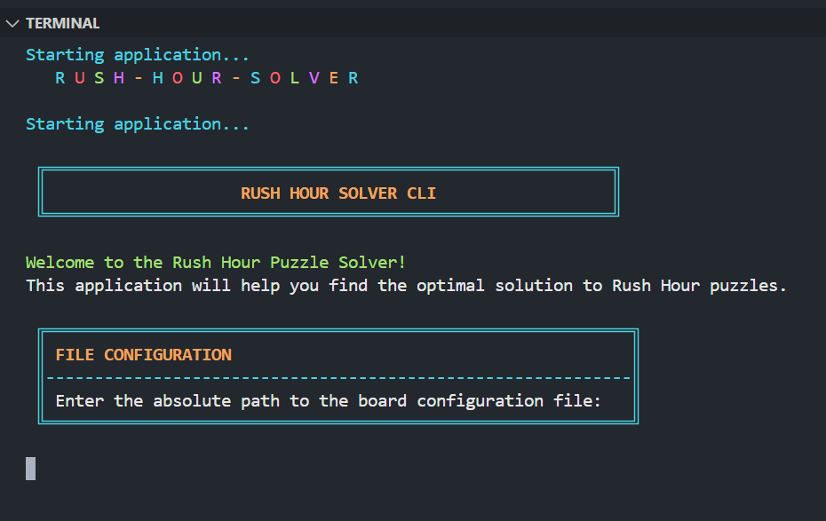
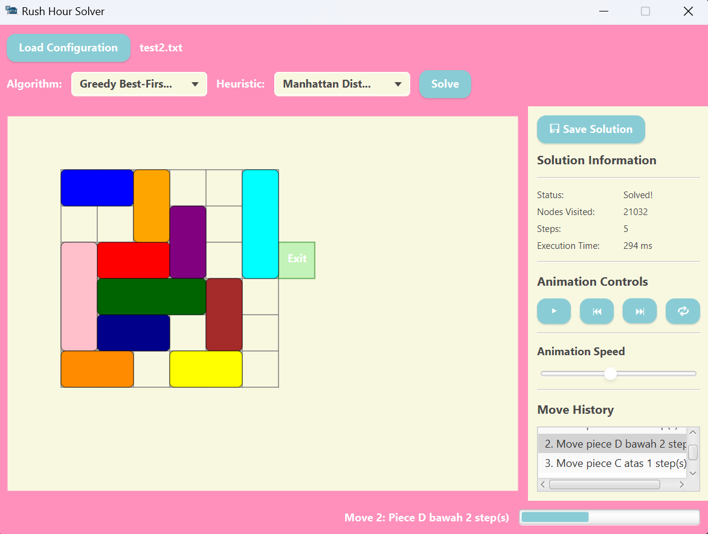

<h1 align="center">Tugas Kecil 3 IF2211 Strategi Algoritma</h1>
<h2 align="center">Semester II Tahun 2024/2025</h2>
<h2 align="center">Penyelesaian Puzzle Rush Hour Menggunakan Algoritma Pathfinding
</h2>

<p align="center">
  
</p>

## Table of Contents
- [Description](#description)
- [Program Structure](#program-structure)
- [Requirements & Installation](#requirements--installation)
- [How to Use](#how-to-use)
- [Author](#author)

## Description
This project is a solution to Tucil 3 of IF2211 - Strategy and Algorithm, Semester II 2024/2025. The program aims to solve the classic Rush Hour puzzle using various pathfinding algorithms, including Uniform Cost Search (UCS), Greedy Best First Search (GBFS), A*, and Beam Search.

The puzzle is loaded from a configuration file, and the program computes a sequence of moves to help the red car (or the designated goal vehicle) reach the exit. For informed search algorithms (GBFS, A*, Beam Search), the program provides two heuristic options: Manhattan Distance and Blocking Heuristic. These heuristics guide the search process to efficiently find a solution with fewer explored nodes.

The application includes two modes of operation:
- **Command-Line Interface (CLI)**, for a text-based interaction and output.

- **Graphical User Interface (GUI)**, built with JavaFX, which offers visual puzzle representation, animated step-by-step solutions, and real-time performance statistics.


## Program Structure
```
├── README.md
├── RushHourSolver.zip
├── build
│   ├── RushHourSolver.jar
│   └── RushHourSolverCLI.jar
├── doc
│   ├── img
│   └── Tucil3_13523091_13523107.pdf
├── src
│   ├── algorithm
│   │   ├── AStar.java
│   │   ├── Algorithm.java
│   │   ├── BeamSearch.java
│   │   ├── GBFS.java
│   │   ├── SolutionPath.java
│   │   └── UCS.java
│   ├── cli
│   │   └── CLI.java
│   ├── gui
│   │   ├── LoadingController.java
│   │   ├── LoadingScreen.fxml
│   │   ├── MainController.java
│   │   ├── MainView.fxml
│   │   ├── RushHourApp.java
│   │   └── assets
│   ├── heuristic
│   │   ├── BlockingHeuristic.java
│   │   ├── Heuristic.java
│   │   └── ManhattanDistance.java
│   ├── model
│   │   ├── Board.java
│   │   ├── Move.java
│   │   ├── Piece.java
│   │   ├── Position.java
│   │   └── State.java
│   └── util
│       ├── BoardParser.java
│       ├── Constants.java
│       └── FileHandler.java
└── test
    ├── input
    └── output
```
- **src** : contains the program's source code in .java files.
- **build** : ontains the compiled .jar files for both the CLI and GUI versions, ready to be executed.
- **test** : contains the testing results included in the assignment report.
- **doc** : contains the assignment report and program documentation.

## Requirements & Installation
Before running the program, follow these steps:
1. Clone this repository
    ```bash
    git clone https://github.com/carllix/Tucil3_13523091_13523107.git
    cd Tucil3_13523091_13523107
    ```
2. Make sure the following are installed on your system:
    - Java Development Kit (JDK) 17 or above
    - JavaFX SDK 17 or above (only required for running the .jar GUI version)

> 💡 JavaFX SDK can be downloaded from: https://gluonhq.com/products/javafx/

> ✅ If you use the self-contained executable package (generated using jpackage), you do not need to install Java or JavaFX manually.

## How to Use
There are three ways to run the program: CLI, GUI via `.jar`, and GUI via self-contained package.
- **Run via Command Line Interface (CLI)**
  ```bash
  java -jar build/RushHourSolverCLI.jar
  ```
  This will launch a text-based interface where you can select a puzzle file, choose an algorithm, and view the solution and statistics directly in the terminal.

- **Run via Graphical User Interface (GUI - JAR)**
  ```bash
  java --module-path /path/to/javafx-sdk/lib --add-modules javafx.controls,javafx.fxml -jar build/RushHourSolver.jar
  ```
  Replace `/path/to/javafx-sdk/lib` with the actual path to your JavaFX SDK’s `lib` folder.
  This will open the GUI where you can interactively load puzzles, choose algorithms and heuristics, and watch the animated solution.

- **Run via GUI Self-Contained Executable Package**

  In the root of this repository, you will find a  `RushHourSolver.zip` file generated using jpackage.
  1. Extract the `.zip` file
  2. Navigate to the extracted folder
  3. Double-click the executable file (`RushHourSolver.exe`)
  > This package is self-contained, meaning it includes its own Java runtime and JavaFX dependencies. No additional installation is required.

## Author
| **NIM**  | **Nama Anggota**               | **Github** |
| -------- | ------------------------------ | ---------- |
| 13523091 | Carlo Angkisan                 | [carllix](https://github.com/carllix) | 
| 13523107 | Heleni Gratia M Tampubolon     | [mineraleee](https://github.com/mineraleee) | 